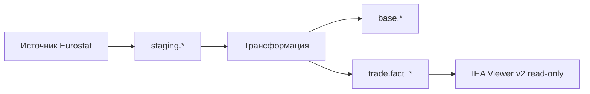

# Инструкция: структура README и docs в репозитории ETL-проекта

| | |
|---|---|
| **Версия** | 1.0 |
| **Дата** | 2026-06-08 |
| **Аудитория** | Внешний разработчик ETL / трансформации данных |
| **Эталон** | Репозиторий **iea-viewer** (v1) — оформление документации |
| **Связанный документ** | [ТЗ выходного слоя БД](external-source-output-contract.md) |

---

## 1. Зачем этот документ

Вы поставляете **PostgreSQL-базу и пайплайн трансформации**, которые подключит веб-viewer.  
Помимо DDL и данных заказчику нужен **оформленный репозиторий** с понятным входом (`README.md`) и структурированной папкой `docs/`.

За образец берётся проект **iea-viewer (v1)** — там уже выстроена навигация по документам.  
Ваш репозиторий — не viewer, а **ETL + выходная БД**; разделы про frontend/backend из v1 **не нужны**, остальная логика сохраняется.

---

## 2. Общая структура репозитория

```
your-etl-project/
├── README.md                 # вход в проект (обязательно)
├── .env.example              # пример подключения к БД
├── docker-compose.yml        # опционально: локальный Postgres / прогон ETL
├── migrations/ или sql/      # DDL выходного слоя
├── src/ или etl/             # код трансформации
└── docs/
    ├── 00_governance/
    │   └── document-map.md   # карта всех документов
    ├── 01_business/
    │   └── vision.md         # зачем источник, границы
    ├── 02_requirements/
    │   └── data-requirements.md
    ├── 03_architecture/
    │   └── pipeline-overview.md
    ├── 07_database/
    │   ├── data-dictionary.md
    │   ├── schema-versioning.md
    │   └── output-contract.md   # копия или ссылка на ТЗ для viewer
    ├── 09_delivery/
    │   └── environments.md
    ├── api.md                  # если есть свой REST — иначе пропустить
    └── data-scope.md
```

Нумерация папок `00_`, `01_`, … — **как в iea-viewer**, для единообразия у заказчика.

---

## 3. Что должен содержать `README.md`

Корневой README — **единственная точка входа**. Пользователь за 5–10 минут должен понять, что за проект и как получить рабочую БД.

### 3.1. Обязательные разделы

Ориентир: [`iea-viewer/README.md`](https://gitlab.cdu.ru/kudryashov/iea-viewer) (v1).

| Раздел | Содержание | Пример для ETL-проекта |
|--------|------------|------------------------|
| **Заголовок и описание** | Одно-два предложения: что за источник, куда кладётся результат | «ETL Eurostat → PostgreSQL, выходной слой для IEA Viewer v2» |
| **Оглавление** | Якорные ссылки на разделы README | Как в v1 |
| **Что делает проект** | Bullet-list возможностей пайплайна | Загрузка, валидация, наполнение `fact_*`, журнал `load_batch` |
| **Структура проекта** | Дерево верхнего уровня | `etl/`, `sql/`, `docs/`, `docker-compose.yml` |
| **Навигация по документации** | Ссылки на ключевые файлы в `docs/` | См. §5 |
| **Быстрый старт** | Пошагово: env → миграции → прогон ETL | Не «клонируйте и разберитесь» |
| **Подключение к БД** | Хост, порт, имя БД, read-only user для viewer | `postgresql://…@host:5432/eurostat_data` |
| **Проверка после прогона** | 2–3 SQL-запроса | `SELECT COUNT(*) FROM base.load_batch` |
| **CI/CD** (если есть) | Кратко: pipeline, deploy | Или «см. `docs/09_delivery/`» |

### 3.2. Рекомендуемые разделы (из v1)

| Раздел | Когда добавлять |
|--------|-----------------|
| **Доступ к сервисам** | Если поднимаете API или Admin UI |
| **Переменные окружения** | Таблица `PGHOST`, `PGDATABASE`, … |
| **Версионирование схемы** | `schema_version: 2026-06` |
| **Связь с viewer** | «Контракт БД: `docs/07_database/output-contract.md`» |

### 3.3. Чего не должно быть в README

| Не класть в README | Куда перенести |
|--------------------|----------------|
| Полный data dictionary | `docs/07_database/data-dictionary.md` |
| DDL всех таблиц | `migrations/` + краткая ссылка в docs |
| Детальное описание каждого поля | data dictionary |
| История обсуждений, протоколы встреч | Вне репозитория или `docs/00_governance/` |
| Длинные ТЗ на отчёты viewer | У заказчика в `docs/ТЗ/` viewer-проекта |

**Правило из v1:** README обновляется при смене **способа запуска**, **подключения к БД**, **списка доменов** и **ссылок на docs**.

---

## 4. Шаблон оглавления README (скопируйте и заполните)

```markdown
# {название-источника}-etl

Краткое описание: ETL {источник} → PostgreSQL, выходной слой для IEA Viewer v2.

## Оглавление

- [Что делает проект](#что-делает-проект)
- [Структура проекта](#структура-проекта)
- [Документация](#документация)
- [Быстрый старт](#быстрый-старт)
- [Подключение к БД](#подключение-к-бд)
- [Проверка данных](#проверка-данных)
- [CI/CD](#cicd)

## Что делает проект

- …

## Структура проекта

- `etl/` — …
- `sql/` — DDL выходного слоя
- `docs/` — документация

## Документация

- [Карта документов](docs/00_governance/document-map.md)
- [Словарь данных](docs/07_database/data-dictionary.md)
- [Контракт выходного слоя](docs/07_database/output-contract.md)

## Быстрый старт

1. `cp .env.example .env`
2. …
3. …

## Подключение к БД

- БД: `{source_id}_data`
- Read-only для viewer: `viewer_ro` / пароль в защищённом хранилище

## Проверка данных

\`\`\`sql
SELECT status, COUNT(*) FROM base.load_batch GROUP BY 1;
\`\`\`

## CI/CD

…
```

---

## 5. Что должно быть в `docs/`

### 5.1. Карта документов (обязательно)

Файл: **`docs/00_governance/document-map.md`**

По образцу v1 [`document-map.md`](https://gitlab.cdu.ru/kudryashov/iea-viewer/-/blob/master/docs/00_governance/document-map.md):

```markdown
# Карта документов проекта

| Раздел | Документ | Содержание |
|--------|----------|------------|
| Бизнес | `01_business/vision.md` | Цель источника, границы, KPI наполнения |
| Требования | `02_requirements/data-requirements.md` | Что загружаем, частоты, ретро-глубина |
| Архитектура | `03_architecture/pipeline-overview.md` | Стадии ETL, схемы staging → curated |
| База данных | `07_database/data-dictionary.md` | Домены, таблицы, grain |
| База данных | `07_database/output-contract.md` | Контракт для viewer |
| Поставка | `09_delivery/environments.md` | Окружения, переменные, деплой |
| Scope | `data-scope.md` | Что входит / не входит в поставку |

## Правило актуальности

README и docs обновляются при изменении схемы, доменов, grain факт-таблиц и способа запуска ETL.
```

### 5.2. Минимальный набор документов

| Путь | Обязательность | Содержание (по образцу v1) |
|------|----------------|----------------------------|
| `00_governance/document-map.md` | **Да** | Индекс всей документации |
| `07_database/data-dictionary.md` | **Да** | Как v1 `data-dictionary.md`: домены, списки `ref_*` / `fact_*`, примечания |
| `07_database/output-contract.md` | **Да** | Контракт для viewer ([шаблон](external-source-output-contract.md)) |
| `09_delivery/environments.md` | **Да** | Как v1 `environments.md`: dev/prod, переменные, порты |
| `data-scope.md` | **Да** | Как v1: домены, ограничения, что не загружается |
| `01_business/vision.md` | Рекомендуется | Упрощённый PRD: зачем источник |
| `02_requirements/data-requirements.md` | Рекомендуется | Частоты, периоды, единицы, источники файлов |
| `03_architecture/pipeline-overview.md` | Рекомендуется | Диаграмма: raw → staging → `base` / `{domain}` |
| `07_database/schema-versioning.md` | Рекомендуется | Как меняется `schema_version`, миграции |
| `api.md` | Только если есть API | Шпаргалка эндпоинтов |

### 5.3. Разделы из v1, которые вам не нужны

| Раздел v1 | Применимость к ETL |
|-----------|-------------------|
| `05_backend/service-catalog.md` | Нет (если нет своего API) |
| `06_frontend/frontend-structure.md` | Нет |
| `api.md` (viewer) | Заменить на описание своего API или убрать |

### 5.4. Содержание ключевых файлов

#### `docs/07_database/data-dictionary.md`

Скопируйте **структуру** v1 `data-dictionary.md`:

1. Правило классификации (`ref` vs `fact`)
2. Список доменов (`base`, `trade`, …)
3. Реестр таблиц по доменам (bullet-lists)
4. Примечания: grain, связи справочников, коды агрегатов

Пример фрагмента:

```markdown
### `trade`

**ref**
- `trade.ref_product`
- `trade.ref_flow`

**fact**
- `trade.fact_trade_flow` — grain: reporter × partner × product × flow × period × unit
```

#### `docs/data-scope.md`

Как v1:

- поддерживаемые домены;
- что в scope / out of scope загрузки;
- известные ограничения (лаги источника, дыры в периодах);
- ссылка на контракт viewer.

#### `docs/09_delivery/environments.md`

Как v1 `environments.md`:

| Окружение | Назначение |
|-----------|------------|
| local | Docker / локальный Postgres |
| test | Стенд заказчика |
| prod | Боевое подключение viewer |

Переменные: `PGHOST`, `PGDATABASE`, строка для `{SOURCE_ID}_DB_URL`.

#### `docs/03_architecture/pipeline-overview.md`

Аналог v1 `architecture-overview.md`, но для ETL:



---

## 6. Соответствие v1 ↔ ETL-проект

| iea-viewer v1 | Ваш ETL-репозиторий |
|---------------|---------------------|
| «Что умеет система» (UI) | «Что делает пайплайн» |
| `docs/05_backend/` | — (нет backend) |
| `docs/06_frontend/` | — (нет UI) |
| `docs/07_database/data-dictionary.md` | **Тот же смысл** — реестр таблиц |
| `docs/api.md` | Опционально — свой API ETL |
| `metadata/descriptions/*.md` | Не в вашем репо — это зона viewer; вы даёте `data-dictionary.md` |
| `backend/app/metadata/tables.py` | У viewer; вы поставляете YAML/JSON каталог в §9 output-contract |

---

## 7. Правила оформления (как в v1)

| Правило | Пояснение |
|---------|-----------|
| Язык | Русский для docs и README (как у заказчика) |
| Имена файлов | `kebab-case.md`, префиксы папок `NN_` |
| Ссылки | Относительные: `[словарь](07_database/data-dictionary.md)` |
| Версии | В нормативных ТЗ — блок «Версия / Дата» в шапке |
| Актуальность | При смене DDL — обновить data-dictionary, output-contract, README |
| Секреты | Только в `.env.example` с плейсхолдерами, не в README |

---

## 8. Чеклист поставки документации

### README.md

- [ ] Описание проекта в 1–2 предложениях
- [ ] Оглавление с якорями
- [ ] Структура каталогов
- [ ] Ссылки на `docs/00_governance/document-map.md`
- [ ] Быстрый старт (пошагово)
- [ ] Строка подключения / имя БД для viewer
- [ ] SQL-проверки после прогона

### docs/

- [ ] `00_governance/document-map.md`
- [ ] `07_database/data-dictionary.md` — все `ref_*` и `fact_*`
- [ ] `07_database/output-contract.md` — контракт для viewer
- [ ] `data-scope.md` — границы данных
- [ ] `09_delivery/environments.md` — окружения
- [ ] `03_architecture/pipeline-overview.md` — схема ETL
- [ ] Нет битых ссылок между документами

### Согласованность с viewer

- [ ] Имена колонок из [контракта БД](external-source-output-contract.md)
- [ ] `schema_version` указан в README и docs
- [ ] Каталог таблиц (YAML/JSON) приложен к data-dictionary

---

## 9. Что передать заказчику

Минимальный комплект для интеграции с viewer:

1. **Ссылка на репозиторий** с оформленным README и `docs/`
2. **Строка подключения** read-only PostgreSQL
3. **`docs/07_database/output-contract.md`** (или этот репозиторий + [единый контракт](external-source-output-contract.md))
4. **`schema_version`** и дата последнего успешного `load_batch`

Viewer-команда по этим материалам регистрирует источник в `config/sources.yaml` без обратных вопросов по структуре БД.

---

*Вопросы по интеграции с viewer — заказчику проекта.*
